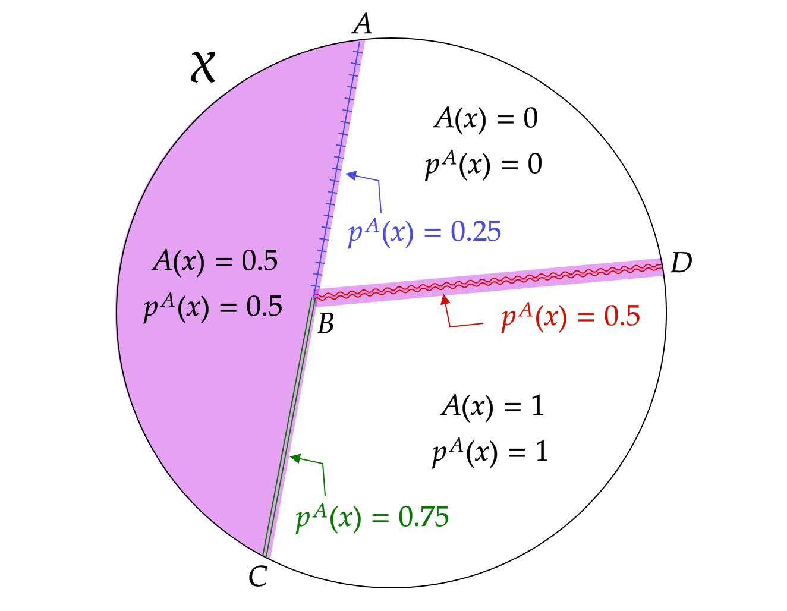

IVaps Framework Overview
=========================

.. _setup:

Setup
-----
We are interested in the effect of some binary treatment :math:`D_i\in \{0,1\}` on some outcome of interest :math:`Y_i`.
Let :math:`Y_i(1)` and :math:`Y_i(0)` represent potential outcomes that would be realized if individual :math:`i` were treated and not treated, respectively. The observed outcome :math:`Y_i` can therefore be written as :math:`Y_i=D_iY_i(1)+(1-D_i)Y_i(0)`.

The treatment assignment :math:`D_i` may be influenced by a binary treatment recommendation :math:`Z_i\in\{0,1\}` made by some machine learning algorithm (A). Let the binary variable :math:`D_i(z)` be the potential treatment assignment when :math:`Z_i=z\in\{0,1\}`. :math:`D_i(z)=1` indicates that individual :math:`i` is treated when the treatment recommendation is :math:`Z_i=z`. Observed treatment :math:`D_i` is therefore :math:`D_i=Z_iD_i(1)+(1-Z_i)D_i(0)`. Define :math:`Y_{zi}=D_i(z)Y_i(1)+(1-D_i(z))Y_i(0)` for each :math:`z=0,1`.

We impose the exclusion restriction that the treatment recommendation :math:`Z_i` does not affect the observed outcome other than through the treatment assignment :math:`D_i`. This allows us to define the potential outcomes indexed against the treatment assignment :math:`D_i` alone.

We consider algorithms that make treatment recommendations based solely on individual :math:`i`'s predetermined, observable covariates :math:`X_i \in \mathbb{R}^p`. Let the function :math:`A:\mathbb{R}^p\rightarrow [0,1]` represent the *decision algorithm*, where :math:`A(X_i)=\Pr(Z_i=1|X_i)` is the probability that the treatment recommendation is turned on for individual :math:`i` with covariates :math:`X_i`. The central assumption is that the analysis knows function :math:`A` and is able to simulate it. That is, the analyst is able to compute the recommendation probability :math:`A(x)` given any input value :math:`x \in \mathbb{R}^p`. The treatment recommendation :math:`Z_i` for individual :math:`i` is determined with probability :math:`A(X_i)` independent of everything else.

APS
---
In order to understand what causal effects can be learned from the data :math:`(X_i, Z_i, D_i, Y_i)` generated by the algorithm :math:`A`, we introduce the *Approximate Propensity Score* (APS). First, let

.. math::

		p^{A}(x;\delta) \equiv\frac{\int_{B(x,\delta)}A(x^*)dx^*}{\int_{B(x,\delta)}dx^*},

where :math:`B(x,\delta)=\{x^*\in\mathbb{R}^p:\|x-x^*\|\le\delta\}` is the :math:`\delta`-ball around :math:`x\in {\cal X}`. Here, :math:`\|\cdot\|` denotes the Euclidean distance on :math:`\mathbb{R}^p`. We assume that :math:`A` is a :math:`{\cal L}^p`-measurable function so that the integrals exist.

We then can define APS as follows.

.. math::

  	p^{A}(x) \equiv \lim_{\delta\rightarrow 0}p^{A}(x;\delta).

Intuitively, APS at :math:`x` is the average probability of a treatment recommendation in a shrinking neighborhood of :math:`x`. To make common :math:`\delta` for all dimensions reasonable, we normalize :math:`X_{ij}` to have mean zero and variance one for each :math:`j=1,...,p`.

The above image illustrates APS. In the example, :math:`X_i` is two dimensional, and the support of :math:`X_i` is divided into three sets depending on the value of :math:`A`. For the interior points of each set, APS is equal to :math:`A`. On the border of any two sets, APS is the average of the :math:`A` values in the two sets. Thus, :math:`p^{A}(x)=\frac{1}{2}(0+0.5)=0.25` for any :math:`x` in the open line segment :math:`AB`, :math:`p^{A}(x)=\frac{1}{2}(0.5+1)=0.75` for any :math:`x` in the open line segment :math:`BC`, and :math:`p^{A}(x)=\frac{1}{2}(0+1)=0.5` for any :math:`x` in the open line segment :math:`BD`.

Identification
--------------

There are 3 key assumptions that allow us to make our identification claim.

1. Conditional Independence: :math:`Z_i \perp\!\!\!\!\perp (Y_i(1),Y_i(0),D_i(1),D_i(0))|X_i`.
2. Almost Everywhere Continuity: :math:`A` is continuous almost everywhere with respect to the Lebesgue measure and :math:`{\cal L}^p({\cal X}_k)={\cal L}^p({\rm int}({\cal X}_k))` for :math:`k=0,1`.
3. Local Mean Continuity: For :math:`z\in\{0,1\}`, the conditional expectation functions :math:`E[Y_{zi}|X_i]` and :math:`E[D_i(z)|X_i]` are continuous at any point :math:`x\in {\cal X}` such that :math:`p^{A}(x)\in (0,1)` and :math:`A(x)\in \{0,1\}`.

From these 3 assumptions we can make the following identification proposition.
Under Assumptions 1-3,

1. :math:`E[Y_{1i}-Y_{0i}| X_i=x]` and :math:`E[D_i(1)-D_i(0)| X_i=x]` are identified for every :math:`x\in \int{{\cal X}}` such that :math:`p^{A}(x)\in (0,1)`.
2. Let :math:`A` be any open subset of :math:`{\cal X}` such that :math:`p^{A}(x)` exists for all :math:`x\in A`. Then either :math:`E[Y_{1i}-Y_{0i}| X_i \in A]` or :math:`E[D_i(1)-D_i(0)| X_i \in A]`, or both are identified only if :math:`p^{A}(x)\in (0,1)` for almost every :math:`x\in A` (with respect to the Lebesgue measure).

This proposition suggests that by conditioning on APS, A-based treatment recommendations are quasi-randomly assigned. We can thus make use of A treatment recommendations as an instrument for treatment assignment, conditional on APS. There are several methods for applying instrumental variables in estimating causal treatment effects. In this package we follow :cite:`Narita2021` in applying two stage least squares (2SLS), though it is certainly possible other methods are added in the future.

The details of the estimation procedure are as follows.

Suppose that we observe a random sample :math:`\{(Y_i,X_i,D_i,Z_i)\}_{i=1}^n` of size :math:`n` from the population whose data generating process is described in :ref:`setup`.

Consider the following 2SLS regression using the observations with :math:`p^{A}(X_i;\delta_n)\in (0,1)`:

.. math::

  \begin{align}
  	D_i&=\gamma_0+\gamma_1 Z_i+\gamma_2 p^{A}(X_i;\delta_n)+\nu_i\\
  	Y_i&=\beta_0+\beta_1 D_i +\beta_2 p^{A}(X_i;\delta_n)+\epsilon_i
  \end{align}

where bandwidth :math:`\delta_n` shrinks toward zero as the sample size :math:`n` increases.

Let :math:`\hat\beta_1` denote the 2SLS estimator of :math:`\beta_1` in the above regression.

The above regression uses true APS :math:`p^{A}(X_i;\delta_n)`, but it may be difficult to analytically compute if :math:`A` is complex. In such a case, we propose a method to approximate :math:`p^{A}(X_i;\delta_n)` using brute force simulation. We draw a value of :math:`x` from the uniform distribution on :math:`B(X_i,\delta_n)` a number of times, compute :math:`A(x)` for each draw, and take the average of :math:`A(x)` over the draws.

Formally, let :math:`X_1^*,...,X_{S_n}^*` be :math:`S_n` independent draws from the uniform distribution on :math:`B(X_i,\delta_n)`, and calculate :math:`p^s(X_i;\delta_n)=\frac{1}{S_n}\sum_{s=1}^{S_n}A(X_{i,s}^*)`.
We compute :math:`p^s(X_i;\delta_n)` for each :math:`i=1,...,n` independently across :math:`i` so that :math:`p^s(X_1;\delta_n),...,p^s(X_n;\delta_n)` are independent of each other. For fixed :math:`n` and :math:`X_i`, the approximation error relative to true :math:`p^{A}(X_i;\delta_n)` has a :math:`1/\sqrt{S_n}` rate of convergence.

This rate does not depend on the dimension of :math:`X_i`, so the simulation error can be made negligible even when :math:`X_i` is high dimensional.

Now consider the following simulation version of the 2SLS regression using the observations with :math:`p^s(X_i;\delta_n)\in (0,1)`:

.. math::

  \begin{align}
  D_i&=\gamma_0(1-I_n)+\gamma_1 Z_i+\gamma_2 p^s(X_i;\delta_n)+\nu_i\\
  Y_i&=\beta_0(1-I_n)+\beta_1 D_i +\beta_2 p^s(X_i;\delta_n)+\epsilon_i.
  \end{align}

:math:`I_n` is the indicator that :math:`A(X_i)` takes on only one nondegenerate value in the sample. If the support of :math:`A(X_i)` (in the population) contains only one value in :math:`(0,1)`, :math:`p^{A}(X_i;\delta_n)` is asymptotically constant conditional on :math:`p^{A}(X_i;\delta_n)\in(0, 1)`. Let :math:`\hat\beta_1^s` denote the 2SLS estimator of :math:`\beta_1` in the simulation-based regression. This regression is the same as the original structural 2SLS regression except that we use the simulated APS :math:`p^s(X_i;\delta_n)` in place of :math:`p^{A}(X_i;\delta_n)`.

In practice, :math:`\hat\beta_1^s` will be the estimated causal treatment effect. Under additional regularity conditions, this estimator is consistent for a well-defined causal effect. The details are ommitted here for brevity. Please refer to :cite:`Narita2021` for more formal statements and proofs of the method described.

Examples
--------

The IVaps method can be applied to a broad swath of algorithms which generate treatment recommendations. Below are a few examples of popular algorithms for which our framework applies.

.. _supervised-learning:

Supervised Learning
~~~~~~~~~~~~~~~~~~~~

Millions of times each year, judges make bail-or-release decisions that hinge on a prediction of what a defendant would do if released. Many judges now use proprietary algorithms (like COMPAS criminal risk score) to make such predictions and use the predictions to support bail-or-release decisions. Kleinberg et al. (2017) also developed another prediction algorithm.

These algorithms fit into our framework as a simple special case. Using our notation, assume that a criminal risk algorithm recommends bailing (:math:`Z_i=1`) and releasing (:math:`Z_i=0`) to each defendent *i*. The algorithm uses defendant *i*'s observable characteristics :math:`X_i`, includinng criminal history and demographics. The algorithm first translates :math:`X_i` into a continuous risk score :math:`r(X_i)`, where :math:`r:\mathbb{R}^p \rightarrow \mathbb{R}` is a function estimated by supervised learning based on past data and assumed to be fixed.

The algorithm then uses the risk score to make the final recommendation:

.. math::

  \begin{align*}
  	Z^{SL}_i&\equiv1\{r(X_i)>c\},\\
  	A^{SL}(x)&=\begin{cases}
  		0 & \ \ \ \text{if $r(x)\leq c$}\\
  		1 & \ \ \ \text{if $r(x)>c$},
  	\end{cases}
  \end{align*}

where :math:`c\in\mathbb{R}` is a constant threshold that is set ex ante.

In this case, the algorithm uses the discretized risk score to make the final recommendation:

.. math::

  Z^{SL}_i\equiv1\{d(r(X_i))>c\}

Suppose that :math:`r` is continuous and is continuously differentiable in a neighborhood of :math:`x`, and :math:`\frac{\partial r(x)}{\partial x}\neq0` for any :math:`x\in{\rm int}({\cal X})` with :math:`r(x)=c`.
APS for this case is given by

.. math::

  p^{SL}(x)=\begin{cases}
  	0 & \ \ \ \text{if }r(x)<c\\
  	0.5 & \ \ \ \text{if } r(x)=c \text{ and } x\in{\rm int}({\cal X})\\
  	1 & \ \ \ \text{if } r(x)>c.
  	\end{cases}

It is therefore possible to identify and estimate causal effects conditional on :math:`x` with :math:`r(x)=c` and :math:`x\in{\rm int}({\cal X})`.

Reinforcement Learning and Bandit
~~~~~~~~~~~~~~~~~~~~~~~~~~~~~~~~~

We are constantly exposed to digital information (movie, music, news, search results, advertisements, and recommendations) through a variety of devices and platforms. Tech companies allocate these pieces of content through reinforcement learning and bandit algorithms. Our method is also applicable to many popular bandit and reinforcement learning algorithms. For simplicity, assume that individuals perfectly comply with the treatment assignment :math:`(D_i=Z_i)`.

1. Bandit Algorithms

The algorithms below first use past data and supervised learning to estimate the conditional means and variances of potential outcomes, :math:`E[Y_i(z)|X_i]` and :math:`Var(Y_i(z)|X_i)`, for each :math:`z\in \{0, 1\}`.
Let :math:`\mu_z(X_i)` and :math:`\sigma^2_z(X_i)` denote the estimators.
The algorithms then use :math:`\mu_z(X_i)` and :math:`\sigma^2_z(X_i)` to determine the treatment assignment for individual :math:`i`.

	A. Thompson Sampling Using Gaussian Priors

	The algorithm first samples potential outcomes from the normal distribution with mean :math:`(\mu_0(X_i), \mu_1(X_i))` and variance covariance matrix :math:`{\rm diag}(\sigma^2_0(X_i), \sigma^2_1(X_i))`. The algorithm then chooses the treatment with the highest sampled potential outcome. As a result, this algorithm chooses the treatment assignment as follows:

	.. math::

		Z^{TS}_i \equiv arg max_{z\in \{0, 1\}}y(z), ~~A^{TS}(X_i)= E[arg max_{z\in \{0, 1\}}y(z)|X_i]

	where :math:`y(z)\sim {\cal N}(\mu_z(X_i), \sigma^2_z(X_i))` independently across :math:`z`.

	The function :math:`A` has an analytical expression:

	.. math::

		A^{TS}(x)=1-\Phi(\dfrac{\mu_0(x)-\mu_1(x)}{\sqrt{\sigma^2_0(x)+\sigma^2_1(x)}})

	where :math:`\Phi` is the CDF of a standard normal distribution.
	Suppose that the functions :math:`\mu_0`, :math:`\mu_1`, :math:`\sigma^2_0` and :math:`\sigma^2_1` are continuous on :math:`{\rm int}({\cal X})`.
	APS for this case is given by

	.. math::

		p^{TS}(x)=1-\Phi(\dfrac{\mu_0(x)-\mu_1(x)}{\sqrt{\sigma^2_0(x)+\sigma^2_1(x)}})

	for any :math:`x\in {\rm int}({\cal X})`. This APS is non-degenerate, meaning that the data from the algorithms allow for causal-effect identification.

	B. Upper Confidence Bound, UCB

	Unlike the above stochastic one, the UCB algorithm is a deterministic algorithm, producing a less obvious example of our framework.
	This algorithm chooses the treatment with the highest upper confidence bound for the potential outcome:

	.. math::

		\begin{align*}
			Z^{UCB}_i &\equiv arg max_{z=0, 1}	\{\mu_z(X_i)+\alpha(X_i) \sigma_z(X_i)\},\\
			A^{UCB}(x) &=\begin{cases}
				0 & \ \ \ \text{if $\mu_1(x)+\alpha(x)\sigma_1(x)<\mu_0(x)+\alpha(x)\sigma_0(x)$}\\
				1 & \ \ \ \text{if $\mu_1(x)+\alpha(x)\sigma_1(x)>\mu_0(x)+\alpha(x)\sigma_0(x)$},
			\end{cases}
		\end{align*}

	where :math:`\alpha(x)` is chosen so that :math:`|\mu_z(x)-E[Y_i(z)|X_i=x]|\leq \alpha(x) \sigma_z(x)` at least with some probability, for example, :math:`0.95`, for each :math:`x`.

	Suppose that the function :math:`\mu_1-\mu_0+\alpha (\sigma_1-\sigma_0)` satisfies the conditions imposed on risk score function :math:`r` in the :ref:`supervised-learning` example with :math:`c=0`.

	APS for this case is given by

	.. math::

		p^{UCB}(x)=\begin{cases}
		0 & \ \ \ \text{if $\mu_1(x)+\alpha(x)\sigma_1(x)<\mu_0(x)+\alpha(x)\sigma_0(x)$}\\
		0.5 & \ \ \ \text{if $\mu_1(x)+\alpha(x)\sigma_1(x)=\mu_0(x)+\alpha(x)\sigma_0(x)$ and $x\in {\rm int}({\cal X})$}\\
		1 & \ \ \ \text{if $\mu_1(x)+\alpha(x)\sigma_1(x)>\mu_0(x)+\alpha(x)\sigma_0(x)$}.
		\end{cases}

	This means that the UCB algorithm produces potentially complicated quasi-experimental variation along the boundary in the covariates space where the algorithm's treatment recommendation changes from one to the other. It is possible to identify and estimate causal effects across the boundary.

..
	2. Reinforcement Learning Algorithms

	Extending bandit algorithms to dynamically changing environments, reinforcement learning algorithms optimize decisions in dynamic environments, where the state (the set of observables that the agent receives from the environment) and action in the current period can affect the future states and outcomes.
	Let :math:`\{(X_{ti}, Z_{ti}, Y_{ti})\}_{t=0}^\infty` denote the trajectory of the states, treatment assignments, and outcomes in periods :math:`t=0,1,2,\cdots` for individual :math:`i`.
	For simplicity, we assume that the trajectory follows a Markov decision process, where the distribution of the state :math:`X_{ti}` only depends on the last state and treatment assignment :math:`(X_{t-1,i}, Z_{t-1,i})`, the distribution of the outcome :math:`Y_{ti}` only depends on the current state and treatment assignment :math:`(X_{ti}, Z_{ti})`, and these distributions are stationary over periods.
	Let :math:`Y_{ti}(1)` and :math:`Y_{ti}(0)` represent the potential outcomes in period :math:`t`.
	Let :math:`Q:{\cal X}\times \{0,1\}\rightarrow \mathbb{R}` be the optimal state-action value function, called the *Q-function*: for :math:`(x,z)\in {\cal X}\times \{0,1\}`,

	.. math::

		Q(x,z)\equiv\max_{\pi: {\cal X}\rightarrow [0,1]}E[\sum_{t=0}^\infty\gamma^{t}(Y_{ti}(1)\pi(X_{ti})+Y_{ti}(0)(1-\pi(X_{ti}))|X_{0i}=x, Z_{0i}=z]

	where :math:`\gamma\in [0,1)` is a discount factor, and :math:`\pi` is a policy function that assigns the probability of treatment to each possible state.

		A. Fitted :math:`Q` Iteration with :math:`\epsilon`-Greedy

		The fitted :math:`Q` iteration algorithm is a batch reinforcement learning algorithm that uses past data to yield an approximation of the :math:`Q`-function.

		Suppose that we have collected a set of :math:`L` four-tuples :math:`\{(x_{t_l}^l, z_{t_l}^l, y_{t_l}^l, x_{t_l+1}^l): l=1,...,L\}` as a result of the agent interacting with the dynamic environment.

		Given :math:`\{(x_{t_l}^l, z_{t_l}^l, y_{t_l}^l, x_{t_l+1}^l): l=1,...,L\}` and an initial approximation :math:`\hat Q` of :math:`Q` (e.g., :math:`\hat Q(x,z)=0` for all :math:`(x,z)`), the algorithm repeats the following steps until some stopping condition is reached:

			1. For each :math:`l=1,...,L`, calculate :math:`q^l=y_{t_l}^l+\gamma\max_{z\in \{0,1\}}\hat Q(x_{t_l+1}^l,z)`.
			2. Use :math:`\{(x_{t_l}^l, z_{t_l}^l, q^l): l=1,...,L\}:math:` and a supervised learning method to train a model that predicts :math:`q` from :math:`(x,z)`. Let the model be a new approximation :math:`\hat Q` of :math:`Q`.

		Possible supervised learning methods used in the second step include tree-based methods, neural networks and deep neural networks.

		The algorithm then uses the estimated :math:`Q`-function to determine the treatment assignment for newly arriving individuals.
		One standard assignment rule is the :math:`\epsilon`-Greedy algorithm, which chooses the best treatment based on :math:`\hat Q(X_{ti}, z)` with probability :math:`1-\frac{\epsilon}{2}` and chooses the other treatment with probability :math:`\frac{\epsilon}{2}`: for each :math:`t`,

		.. math::

			\begin{align*}
			Z^{\epsilon}_{ti}&\equiv \begin{cases}
			arg max_{z=0, 1}\hat Q(X_{ti}, z) & \ \ \ \text{with probability $1-\frac{\epsilon}{2}$}\\
			1-arg max_{z=0, 1}\hat Q(X_{ti}, z) & \ \ \ \text{with probability $\frac{\epsilon}{2}$},
			\end{cases}\\
			A^{\epsilon}(x)&=\begin{cases}
			\frac{\epsilon}{2} & \ \ \ \text{if $\hat Q(x,1)<\hat Q(x,0)$}\\
			1-\frac{\epsilon}{2} & \ \ \ \text{if $\hat Q(x,1)>\hat Q(x,0)$}.
			\end{cases}
			\end{align*}

		Suppose that the function :math:`\hat Q(\cdot,1)-\hat Q(\cdot,0)` satisfies the condition imposed on :math:`r` in the :ref:`supervised-learning` example with :math:`c=0`.
		APS for this case is given by

		.. math::

			p^{\epsilon}(x)=\begin{cases}
			\frac{\epsilon}{2} & \ \ \ \text{if $\hat Q(x,1)<\hat Q(x,0)$}\\
			0.5 & \ \ \ \text{if $\hat Q(x,1)=\hat Q(x,0)$ and $x\in {\rm int}({\cal X})$}\\
			1-\frac{\epsilon}{2} & \ \ \ \text{if $\hat Q(x,1)>\hat Q(x,0)$}.
			\end{cases}

		B. Policy Gradient Methods

			Policy gradient methods such as REINFORCE approximate the optimal policy function by parametrization and learn the parameter using stochastic gradient ascent.
			Let :math:`\pi(x;\theta)` be a parametrization of the policy function that is differentiable with respect to :math:`\theta`.
			For example, :math:`\pi` might be a softmax function with a linear index: :math:`\pi(x;\theta)=\frac{\exp(x'\theta)}{1+\exp(x'\theta)}`.
			Another example is a neural network whose input is a representation of the state :math:`x`, whose output is the treatment assignment probability, and whose weights are represented by the parameter :math:`\theta`.

			Suppose that we have collected a set of :math:`L` trajectories :math:`\{\{(x_{t}^l, z_{t}^l, y_{t}^l)\}_{t=0}^{T_l}: l=1,...,L\}` by running the policy :math:`\pi(x;\theta^0)` for :math:`L` individuals.
			Policy gradient methods such as REINFORCE Actor-Critic Methods use the trajectories to update the policy parameter to :math:`\theta_1` by stochastic gradient ascent. The algorithms then use the updated policy function :math:`\pi(x;\theta^1)` to determine the treatment assignment for new episodes. For each :math:`t`,

			.. math::

				\begin{align*}
				Z^{PG}_{ti}&\equiv \begin{cases}
				1 & \ \ \ \text{with probability $\pi(X_{ti};\theta^1)$}\\
				0 & \ \ \ \text{with probability $1-\pi(X_{ti};\theta^1)$},
				\end{cases}\\
				A^{TG}(x)&= \pi(x;\theta^1).
				\end{align*}

			Suppose that the function :math:`\pi(\cdot;\theta^1)` is continuous on :math:`{\rm int}({\cal X})`.
			APS for this case is given by

			.. math::

				p^{TG}(x)= \pi(x;\theta^1)

			for any :math:`x\in {\rm int}({\cal X})`.

Unsupervised Learning
~~~~~~~~~~~~~~~~~~~~~

Customer segmentation is a core marketing practice that divides a company's customers into groups based on their characteristics and purchasing behavior so that the company can effectively target marketing activities at each group.
Many businesses today use unsupervised learning algorithms, clustering algorithms in particular, to perform customer segmentation.
Using our notation, assume that a company decides whether it targets a campaign at customer :math:`i` (:math:`Z_i=1`) or not (:math:`Z_i=0`).
The company first uses a clustering algorithm such as :math:`K` means clustering or Gaussian mixture model clustering to divide customers into :math:`K` groups, making a partition :math:`\{S_1,...,S_K\}` of the covariate space :math:`\mathbb{R}^p`.
The company then conducts the campaign targeted at some of the groups:

.. math::

	\begin{align*}
		Z^{CL}_i&\equiv1\{X_i\in \cup_{k\in T} S_k\},\\
		A^{CL}(x)&= \begin{cases}
			0 & \ \ \ \text{if $x\notin \cup_{k\in T} S_k$}\\
			1 & \ \ \ \text{if $x\in \cup_{k\in T} S_k$},
		\end{cases}
	\end{align*}

where :math:`T\subset \{1,..,K\}` is the set of the indices of the target groups.

For example, suppose that the company uses :math:`K`-means clustering, which creates a partition in which a covariate value :math:`x` belongs to the group with the nearest centroid.
Let :math:`c_1,...,c_K` be the centroids of the :math:`K` groups, and define a set-valued function :math:`C:\mathbb{R}^p\rightarrow 2^{\{1,...,K\}}`, where :math:`2^{\{1,...,K\}}` is the power set of :math:`\{1,...,K\}`, as

.. math::

	C(x)\equiv arg min_{k\in \{1,...,K\}}\|x-c_k\|.

If :math:`C(x)` is a singleton, :math:`x` belongs to the only group in :math:`C(x)`.
If :math:`C(x)` contains more than one indices, the group to which :math:`x` belongs is arbitrarily determined.

APS for this case is given by

.. math::

	p^{CL}(x)=\begin{cases}
	0 & \ \ \ \text{if $C(x)\cap T= \emptyset$}\\
	0.5 & \ \ \ \text{if $|C(x)|=2$, $x\in \partial(\cup_{k\in T} S_k)$ and $x\in {\rm int}({\cal X})$}\\
	1 & \ \ \ \text{if $C(x)\subset T$}
	\end{cases}

and :math:`p^{CL}(x)\in (0,1)` if :math:`|C(x)|\ge 3`, :math:`x\in \partial(\cup_{k\in T} S_k)` and :math:`x\in {\rm int}({\cal X})`,
where :math:`|C(x)|` is the number of elements in :math:`C(x)`, and :math:`\partial(\cup_{k\in T} S_k)` is the boundary of :math:`\cup_{k\in T} S_k`.
Thus, it is possible to identify causal effects conditional on observables :math:`x` on the boundary :math:`\partial(\cup_{k\in T} S_k)`.
